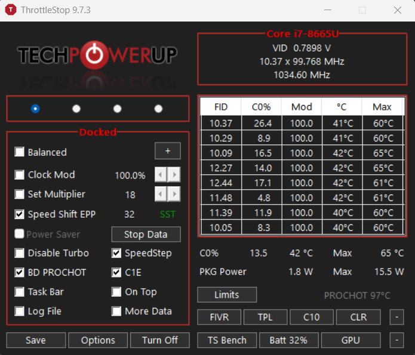
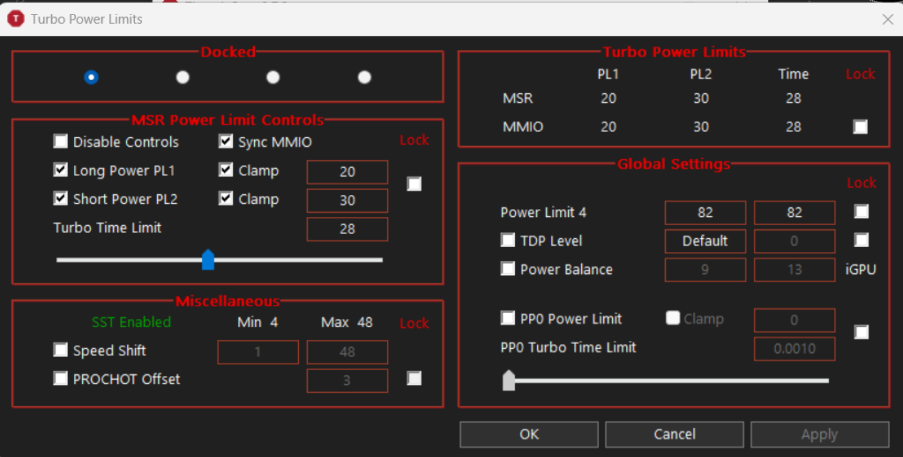
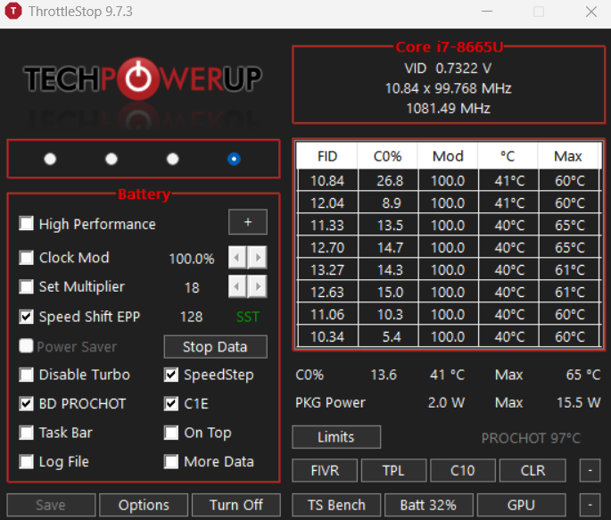
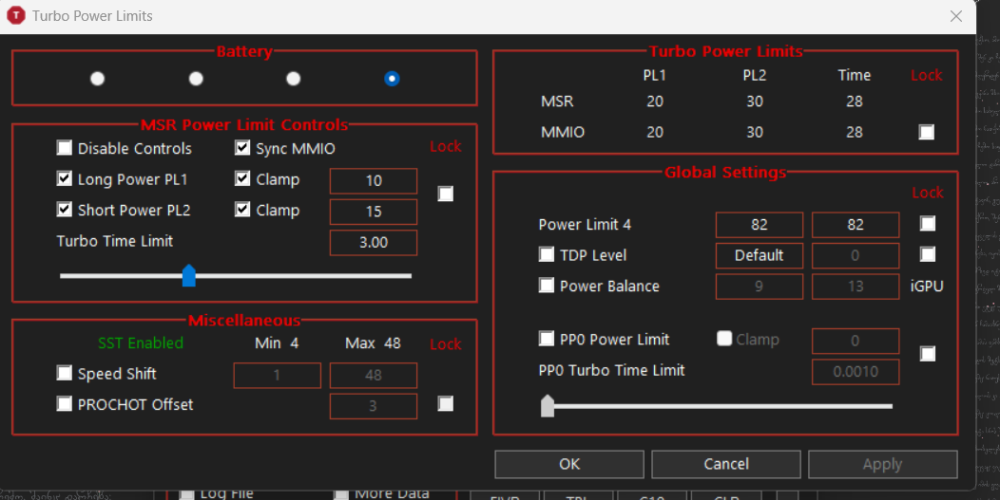

# ThinkPad T490 Performance & Cooling Mod

A small hardware + software tuning project for my **Lenovo ThinkPad T490**, focused on getting better sustained CPU performance while docked without turning the machine into a permanently high-power laptop.

The main changes are:

- upgraded cooling with a **dual-heatpipe Sunon fan/heatsink assembly**
- replaced conventional thermal paste with **Honeywell PTM7950**
- separate **ThrottleStop profiles** for docked and battery use
- an **80% battery charge threshold** for mostly-docked use

> **Note:** This README documents the setup shown in my screenshots. Power limits, temperatures, and stability can vary between individual T490 units. Do not blindly copy tuning values without testing your own laptop.

---

## Machine Specs

| Component | Configuration |
|---|---|
| Laptop | Lenovo ThinkPad T490 |
| CPU | Intel Core i7-8665U |
| RAM | 32 GB |
| Display | Full HD touchscreen |
| Storage | 512 GB SSD |
| Cooling | Dual-heatpipe Sunon fan/heatsink |
| Thermal interface | Honeywell PTM7950 |

---

## Why I Did This

The stock T490 cooling system is designed around a thin-and-light power envelope. It works, but sustained CPU boost can become limited by temperature and/or power during heavier workloads.

Because I use this laptop docked a lot, I wanted two different behaviors:

- **Docked:** prioritize responsiveness and sustained CPU performance.
- **Battery:** reduce power consumption and heat while keeping the laptop pleasant to use.

Instead of simply forcing maximum performance all the time, I combined the cooling upgrade with profile-based power management.

---

# Hardware Mod

## Dual-Heatpipe Sunon Cooling Assembly

I replaced the original cooler with a **dual-heatpipe Sunon fan/heatsink assembly**.

The extra heatpipe gives the cooling system more thermal capacity and a better path for moving CPU heat toward the fin stack. This is especially useful when the CPU is allowed to stay at higher package power while the laptop is docked.

## PTM7950

I used **Honeywell PTM7950** as the CPU thermal interface material.

PTM7950 is a phase-change thermal material that is popular for laptops because it performs well under repeated thermal cycling and is less prone to the pump-out behavior that some conventional thermal pastes can experience in mobile hardware.

The photo below shows the board during the cooler swap / thermal-interface work.

---

# ThrottleStop Setup

I use **ThrottleStop 9.7.3** with separate profiles for **Docked** and **Battery** operation.

The important idea is not one single magic setting; it is using a more aggressive profile when external power and cooling headroom are available, then switching to a more conservative profile on battery.

## Docked Profile

The docked profile is configured around higher responsiveness and sustained CPU power.

### Main profile

- **Speed Shift EPP:** `32`
- **SpeedStep:** enabled
- **C1E:** enabled
- **BD PROCHOT:** enabled
- **Disable Turbo:** unchecked, so Turbo Boost remains available

### Turbo Power Limits

The docked TPL screenshot shows:

- **PL1 / Long Power:** `20 W`
- **PL2 / Short Power:** `30 W`
- **Turbo Time Limit:** `28 s`
- **Sync MMIO:** enabled
- **Clamp:** enabled for PL1 and PL2

.

This gives the CPU noticeably more power headroom than a battery-focused configuration while still keeping explicit limits in place.

---

## Battery Profile

The battery profile is tuned to favor efficiency.

### Main profile

- **Speed Shift EPP:** `128`
- **SpeedStep:** enabled
- **C1E:** enabled
- **BD PROCHOT:** enabled
- **Disable Turbo:** unchecked

.

### Battery TPL values shown in the profile

The Battery TPL editor shows these profile values:

- **PL1 / Long Power:** `10 W`
- **PL2 / Short Power:** `15 W`
- **Turbo Time Limit:** `3 s`

.

### Important screenshot detail

In that Battery TPL screenshot, the editable profile fields show **10 W / 15 W / 3 s**, while the live **Turbo Power Limits** readout at the top still shows **20 W / 30 W / 28 s** for MSR/MMIO.

That means the screenshot by itself does **not** prove that the lower battery limits were active at that exact moment. Depending on the ThrottleStop state, the profile may have been edited but not yet applied, or the active limits may still have been inherited from the docked profile / firmware.

So I treat **10 W / 15 W / 3 s as the intended Battery profile values**, rather than claiming the screenshot confirms they were active.

---

# Battery Preservation

Because this laptop spends a lot of time connected to a dock, I use an **80% charge threshold**.

The goal is to avoid keeping the battery at 100% for long periods when I do not need the full battery capacity. When I know I will be away from power for a long time, I can temporarily change the threshold and charge higher.

---

# Observed Idle / Light-Load Behavior

The screenshots were taken under a very light workload, so they are **not benchmark results**. Still, they give a useful look at the machine after the cooling and profile changes.

From the screenshots:

- current CPU temperature was around **40–42 °C**
- recorded per-core maximums were around **60–65 °C**
- package power was around **1.8–2.0 W** at that moment
- the CPU was clocking around **1.0 GHz** under the light load shown

These values mainly demonstrate that the system can idle down normally even with the performance-oriented docked profile.

---

# Profile Summary

| Setting | Docked | Battery |
|---|---:|---:|
| Speed Shift EPP | 32 | 128 |
| PL1 | 20 W | 10 W intended |
| PL2 | 30 W | 15 W intended |
| Turbo Time Limit | 28 s | 3 s intended |
| Turbo Boost | Enabled | Enabled |
| SpeedStep | Enabled | Enabled |
| C1E | Enabled | Enabled |
| BD PROCHOT | Enabled | Enabled |

The lower EPP value on the docked profile makes the CPU more eager to boost, while the higher battery EPP value biases the system toward efficiency.

---

# What This Mod Is Trying to Achieve

This setup is aimed at balancing four things:

1. **better sustained CPU performance when docked**
2. **better thermal transfer with PTM7950**
3. **more cooling capacity from the dual-heatpipe assembly**
4. **reasonable battery behavior when unplugged**

It is not intended to turn the T490 into a gaming laptop or bypass every thermal protection mechanism. I keep safeguards such as **BD PROCHOT** enabled and use defined power limits instead of simply removing limits.

---

# Things Worth Testing

For anyone repeating a similar mod, useful before/after measurements would include:

- Cinebench or another repeatable CPU benchmark
- sustained package power after 5–10 minutes
- maximum CPU temperature
- clock speed during a sustained all-core workload
- fan noise / RPM behavior
- idle temperature
- battery runtime under a repeatable workload

A good comparison should use the same room temperature, Windows power mode, BIOS settings, workload, and background processes.

---

# Safety / Disclaimer

Opening a laptop and changing its cooling hardware can damage the motherboard, fan connectors, battery, display cables, or other components if done incorrectly. Incorrect power settings can also cause instability, excess heat, or unexpected throttling.

This repository is a record of **my own T490 configuration**, not a guarantee that the same values are appropriate for every machine.

---

## Gallery

### Battery profile

### Docked profile

### Docked turbo power limits

### Battery turbo power limits

### Cooling hardware

### Motherboard during the mod

---

## Future Updates

Possible additions to this project:

- before/after benchmark results
- fan noise comparison
- sustained temperature graphs
- exact part number for the dual-heatpipe Sunon assembly
- Lenovo battery-threshold screenshots/configuration
- BIOS version and Windows power-plan details
- ThrottleStop configuration export

