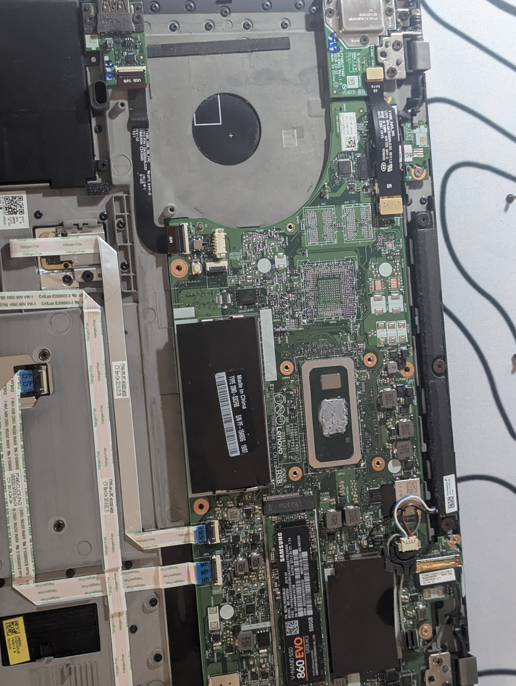
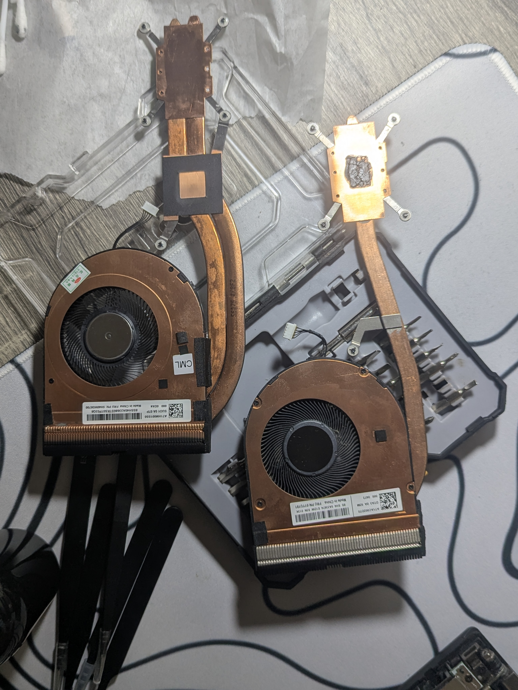

# 🔥 ThinkPad T490 — *Pocket Workstation* Mod

> **A tiny 14-inch business laptop with a bigger cooling system, PTM7950, sane power limits, and two personalities: _Docked Beast_ + _Battery Chill_.**


This repo documents my **Lenovo ThinkPad T490 performance / cooling mod**. The goal was simple: get noticeably better sustained CPU performance while docked, without making battery mode hot, noisy, or wasteful.

The recipe:

- 🌀 **dual-heatpipe Sunon fan/heatsink**
- 🧊 **Honeywell PTM7950** on the CPU
- ⚡ separate **ThrottleStop Docked + Battery profiles**
- 🔋 **80% battery charge threshold** for mostly-docked use
- 🧠 current Lenovo BIOS / EC firmware
- 🛡️ thermal protections kept enabled

---

## 🧾 The Machine

| Part | My T490 |
|---|---|
| **Model** | Lenovo ThinkPad T490 |
| **CPU** | Intel Core i7-8665U |
| **RAM** | 32 GB |
| **Display** | 14-inch Full HD touchscreen |
| **Storage** | 512 GB SSD |
| **Cooling** | Dual-heatpipe Sunon fan/heatsink assembly |
| **Thermal interface** | Honeywell PTM7950 |
| **Main use** | Docked productivity + portable daily driver |

### Firmware baseline

As of **25 September 2026**, Lenovo's current T490 BIOS package is:

| Firmware | Version |
|---|---:|
| **UEFI BIOS** | **1.85** |
| **Embedded Controller** | **1.28** in Lenovo's current release table* |
| **Lenovo release date** | **25 May 2026** |
| **Lenovo severity** | **Critical** |

Official Lenovo package:  
https://support.lenovo.com/us/en/downloads/ds539061

*Lenovo’s download header currently displays `1.85/1.26`, while the release-history table on the same page lists BIOS `1.85` with ECP `1.28` (`N2IHT44W`). Check the Lenovo page for your exact machine type before flashing.

> [!TIP]
> Firmware changes can affect thermals, power limits, charging, USB-C/Thunderbolt behavior, and ThrottleStop behavior. If somebody copies this project, I recommend starting from the latest Lenovo firmware available for their exact T490 machine type.

---

## 📷 Project Photos

A quick look at the hardware side of the project before getting into the settings.

| T490 motherboard during the mod | Dual-heatpipe cooling hardware |
|---|---|
|  |  |

---

# 🧊 Hardware Mod — Give the 8665U Some Breathing Room

The stock T490 cooling setup is built for a thin business laptop. That is fine for normal office use, but sustained boost loads can quickly run into thermal or power limits.

My answer was not **"remove every limit and pray."** 😅

I upgraded the cooling first, then tuned power around the new thermal headroom.

## 1. Dual-heatpipe Sunon cooler

I swapped in a **dual-heatpipe Sunon fan/heatsink assembly**.

The second heatpipe gives the system more capacity to move heat away from the CPU and toward the fin stack. That matters most during longer CPU-heavy workloads where a short boost turns into sustained package power.


## 2. PTM7950

For the CPU thermal interface I used **Honeywell PTM7950** instead of normal paste.

PTM7950 is a phase-change thermal material commonly used in compact systems because it handles repeated heating/cooling cycles well and can be a good fit for laptop dies where ordinary paste can degrade or pump out over time.


> [!CAUTION]
> Opening a laptop, removing a heatsink, and changing thermal material can damage components if done incorrectly. Disconnect power/battery as appropriate and do not copy somebody else's power limits blindly.

---

# ⚡ Two Personalities: Docked Beast vs Battery Chill

I use **ThrottleStop 9.7.3** with separate profiles.

Instead of forcing one compromise profile everywhere, the laptop behaves differently depending on how I am using it:

| | 🖥️ **Docked Beast** | 🔋 **Battery Chill** |
|---|---:|---:|
| **Speed Shift EPP** | **32** | **128** |
| **PL1 / Long Power** | **20 W** | **10 W intended** |
| **PL2 / Short Power** | **30 W** | **15 W intended** |
| **Turbo Time Limit** | **28 s** | **3 s intended** |
| **Turbo Boost** | Enabled | Enabled |
| **SpeedStep** | Enabled | Enabled |
| **C1E** | Enabled | Enabled |
| **BD PROCHOT** | Enabled | Enabled |

The docked profile is allowed to be more eager to boost. The battery profile backs off so the machine runs cooler and wastes less energy away from the charger.

---

## 🖥️ Docked Beast

### Main profile

- **Speed Shift EPP:** `32`
- **SpeedStep:** enabled
- **C1E:** enabled
- **BD PROCHOT:** enabled
- **Disable Turbo:** unchecked → Turbo Boost remains available


### Turbo Power Limits

- **PL1:** `20 W`
- **PL2:** `30 W`
- **Turbo Time Limit:** `28 s`
- **Sync MMIO:** enabled
- **Clamp:** enabled for PL1 + PL2


This profile is where the dual-heatpipe + PTM7950 upgrade earns its keep: the CPU gets more sustained power headroom while the upgraded cooling has a better chance of carrying that heat away.

---

## 🔋 Battery Chill

### Main profile

- **Speed Shift EPP:** `128`
- **SpeedStep:** enabled
- **C1E:** enabled
- **BD PROCHOT:** enabled
- **Disable Turbo:** unchecked


### Intended battery TPL

- **PL1:** `10 W`
- **PL2:** `15 W`
- **Turbo Time Limit:** `3 s`


> [!NOTE]
> The Battery TPL editor in my screenshot shows **10 W / 15 W / 3 s**, but the live MSR/MMIO readout at the top still shows **20 W / 30 W / 28 s**. So the screenshot proves those are my **intended Battery profile values**, not that they were already active at that exact moment.

---

# 🔋 Battery Preservation

Because this T490 spends a lot of time on a dock, I cap charging at **80%**.

That way the battery is not sitting at 100% every day when I do not actually need all of its capacity. Before a long unplugged day, the threshold can be changed temporarily and the battery charged higher.

**Daily docked target:** `80%`

---

# 🌡️ What the Screenshots Show

These screenshots are **idle / light-load observations**, not benchmark results.

At the moment captured:

- CPU temperature: roughly **40–42 °C**
- recorded per-core maximums: about **60–65 °C**
- CPU package power: roughly **1.8–2.0 W**
- current clock under light load: about **1.0 GHz**

The nice part is that the performance-oriented docked setup still lets the processor clock down normally when there is nothing useful to do.

---

# 🧪 Benchmark Quest

This repo is more fun when it has numbers, so these are the next things I want to record properly:

- [ ] Cinebench single-core / multi-core
- [ ] 10-minute sustained CPU load
- [ ] maximum CPU temperature
- [ ] sustained CPU package power
- [ ] sustained all-core clock
- [ ] fan noise comparison
- [ ] stock cooler vs dual-heatpipe cooler
- [ ] normal paste vs PTM7950
- [ ] docked vs battery profile
- [ ] battery runtime test

### Benchmark table — coming soon™

| Test | Stock | Modded | Difference |
|---|---:|---:|---:|
| Cinebench | — | — | — |
| 10 min CPU temp | — | — | — |
| Sustained package power | — | — | — |
| Sustained clock | — | — | — |

For a fair comparison I want the **same room temperature, BIOS, Windows power mode, background apps, test duration, and workload**.

---

# 🧠 Mod Philosophy

This is not a **"MAX EVERYTHING"** build.

The idea is:

```text
better cooling
      +
controlled power limits
      +
separate AC / battery behavior
      +
battery charge management
      =
a nicer T490 to actually use
```

I intentionally keep things like **BD PROCHOT** enabled. The goal is to improve the laptop, not delete every safety mechanism for a benchmark screenshot.

---

# 🛠️ Software / Maintenance Checklist

For this setup I keep an eye on:

- Lenovo BIOS / Embedded Controller updates
- Lenovo power-management components
- Intel chipset / graphics updates
- USB-C / Thunderbolt firmware where applicable
- ThrottleStop profile behavior after BIOS updates
- battery charge threshold after Lenovo software/firmware changes
- fan behavior and temperatures after servicing the cooler

> [!IMPORTANT]
> A firmware update can reset or change low-level behavior. After updating BIOS/EC, I re-check temperatures, boost behavior, power limits, and battery settings instead of assuming everything is unchanged.

---

# 📸 Full Project Gallery

All images below are stored directly in this repository, so the README works without an `assets/` folder. Click an image on GitHub to view it full-size.


### Docked profile


### Docked TPL


### Battery profile


### Battery TPL


### Cooling hardware


### Motherboard during the mod


---

# 🚧 Future Upgrades to This Repo

- exact Sunon cooler part number
- actual before/after benchmark graphs
- battery-threshold screenshot
- BIOS setup screenshots
- ThrottleStop configuration export
- Windows power-plan details
- SSD model + health / benchmark info
- dock model and peripherals
- fan acoustics under sustained load

---

# ⚠️ Disclaimer

This repository documents **my own ThinkPad T490**. Hardware revisions, firmware, ambient temperature, silicon quality, cooling condition, and workload all matter.

Do not assume the same power limits or temperatures are correct for every T490. Hardware mods and incorrect power settings can cause instability, overheating, damaged connectors, damaged components, or lost data.

**Measure first. Change one thing at a time. Test after every change.**

---

## ❤️ Why keep a T490 alive?

Because a well-built older ThinkPad with **32 GB RAM, a touchscreen, replaceable parts, a proper keyboard, and upgraded cooling** is still a ridiculously useful little machine.

And because modifying ThinkPads is fun. 😎
